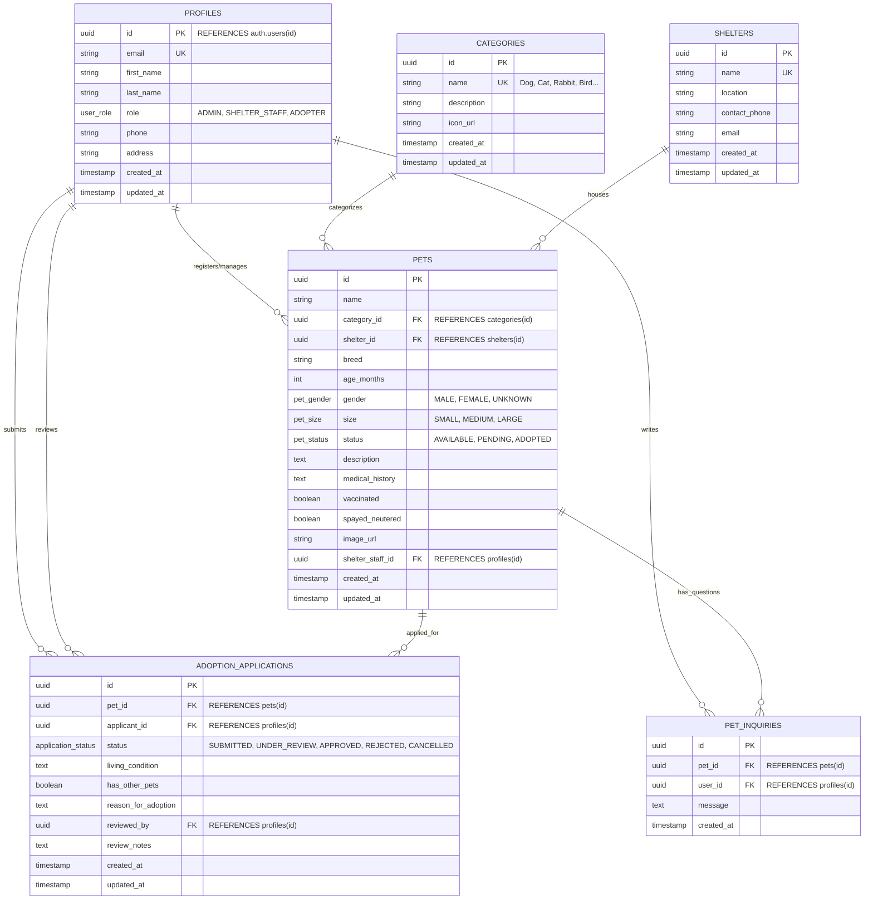

# 🗄️ Entity Relationship Diagram (ERD) & Database Specification
**โครงการ: Pet Adoption API (Supabase Backend)**  
**ผู้รับผิดชอบ: สมาชิกคนที่ 1 (Database & Supabase Lead)**  
**Git Branch: `feat/supabase-db`**  

---

## 1. Entity-Relationship Diagram (ERD)

---

## 2. พจนานุกรมข้อมูล (Data Dictionary & Column Specifications)

### 2.1 ตาราง `profiles` (บัญชีและบทบาทผู้ใช้งาน)
*ขยายความสามารถจากตาราง `auth.users` ของ Supabase*

| ชื่อคอลัมน์ | ประเภทข้อมูล | เงื่อนไข (Constraints) | คำอธิบาย |
| :--- | :--- | :--- | :--- |
| `id` | UUID | PRIMARY KEY, REFERENCES `auth.users(id)` ON DELETE CASCADE | รหัสประจำตัวตรงกับ Supabase Auth |
| `email` | TEXT | NOT NULL, UNIQUE | อีเมลผู้ใช้งาน |
| `first_name` | TEXT | NOT NULL, DEFAULT '' | ชื่อจริง |
| `last_name` | TEXT | NOT NULL, DEFAULT '' | นามสกุล |
| `role` | `user_role` (ENUM) | NOT NULL, DEFAULT 'ADOPTER' | บทบาท: `ADMIN`, `SHELTER_STAFF`, `ADOPTER` |
| `phone` | TEXT | NULLABLE | เบอร์โทรศัพท์ติดต่อ |
| `address` | TEXT | NULLABLE | ที่อยู่ผู้ขอรับเลี้ยง |
| `created_at` | TIMESTAMPTZ | DEFAULT now() | วันที่สร้างโปรไฟล์ |
| `updated_at` | TIMESTAMPTZ | DEFAULT now() | วันที่ปรับปรุงข้อมูลล่าสุด |

---

### 2.2 ตาราง `categories` (หมวดหมู่ / ชนิดสัตว์)

| ชื่อคอลัมน์ | ประเภทข้อมูล | เงื่อนไข (Constraints) | คำอธิบาย |
| :--- | :--- | :--- | :--- |
| `id` | UUID | PRIMARY KEY, DEFAULT gen_random_uuid() | รหัสหมวดหมู่ |
| `name` | TEXT | NOT NULL, UNIQUE | ชื่อชนิดสัตว์ (เช่น Dog, Cat, Rabbit, Bird) |
| `description` | TEXT | NULLABLE | รายละเอียดชนิดสัตว์ |
| `icon_url` | TEXT | NULLABLE | ลิงก์ไอคอนหรือรูปภาพตัวแทน |
| `created_at` | TIMESTAMPTZ | DEFAULT now() | วันที่บันทึก |
| `updated_at` | TIMESTAMPTZ | DEFAULT now() | วันที่แก้ไข |

---

### 2.3 ตาราง `shelters` (ศูนย์พักพิงสัตว์ / สาขา)

| ชื่อคอลัมน์ | ประเภทข้อมูล | เงื่อนไข (Constraints) | คำอธิบาย |
| :--- | :--- | :--- | :--- |
| `id` | UUID | PRIMARY KEY, DEFAULT gen_random_uuid() | รหัสศูนย์พักพิง |
| `name` | TEXT | NOT NULL, UNIQUE | ชื่อศูนย์พักพิง |
| `location` | TEXT | NOT NULL | สถานที่ตั้ง / ที่อยู่ศูนย์ |
| `contact_phone` | TEXT | NULLABLE | เบอร์ติดต่อศูนย์ |
| `email` | TEXT | NULLABLE | อีเมลติดต่อ |
| `created_at` | TIMESTAMPTZ | DEFAULT now() | วันที่บันทึก |
| `updated_at` | TIMESTAMPTZ | DEFAULT now() | วันที่แก้ไข |

---

### 2.4 ตาราง `pets` (ข้อมูลสัตว์เลี้ยงหาบ้าน)

| ชื่อคอลัมน์ | ประเภทข้อมูล | เงื่อนไข (Constraints) | คำอธิบาย |
| :--- | :--- | :--- | :--- |
| `id` | UUID | PRIMARY KEY, DEFAULT gen_random_uuid() | รหัสสัตว์เลี้ยง |
| `name` | TEXT | NOT NULL | ชื่อสัตว์เลี้ยง |
| `category_id` | UUID | REFERENCES `categories(id)` ON DELETE RESTRICT | เชื่อมโยงชนิดสัตว์ |
| `shelter_id` | UUID | REFERENCES `shelters(id)` ON DELETE SET NULL | สังกัดศูนย์พักพิง |
| `breed` | TEXT | NOT NULL | สายพันธุ์ |
| `age_months` | INTEGER | NOT NULL, DEFAULT 0 | อายุ (จำนวนเดือน) |
| `gender` | `pet_gender` (ENUM) | DEFAULT 'UNKNOWN' | เพศ (`MALE`, `FEMALE`, `UNKNOWN`) |
| `size` | `pet_size` (ENUM) | DEFAULT 'MEDIUM' | ขนาดตัว (`SMALL`, `MEDIUM`, `LARGE`) |
| `status` | `pet_status` (ENUM) | DEFAULT 'AVAILABLE' | สถานะ (`AVAILABLE`, `PENDING`, `ADOPTED`) |
| `description` | TEXT | NULLABLE | นิสัยและพฤติกรรม |
| `medical_history` | TEXT | NULLABLE | ประวัติสุขภาพ / การรักษา |
| `vaccinated` | BOOLEAN | DEFAULT false | รับวัคซีนครบถ้วนหรือไม่ |
| `spayed_neutered` | BOOLEAN | DEFAULT false | ทำหมันแล้วหรือไม่ |
| `image_url` | TEXT | NULLABLE | รูปภาพใน Supabase Storage Bucket |
| `shelter_staff_id` | UUID | REFERENCES `profiles(id)` ON DELETE SET NULL | เจ้าหน้าที่ผู้ดูแลเคส |
| `created_at` | TIMESTAMPTZ | DEFAULT now() | วันที่ลงทะเบียน |
| `updated_at` | TIMESTAMPTZ | DEFAULT now() | วันที่ปรับปรุงข้อมูล |

---

### 2.5 ตาราง `adoption_applications` (ใบสมัครขอรับเลี้ยงสัตว์)

| ชื่อคอลัมน์ | ประเภทข้อมูล | เงื่อนไข (Constraints) | คำอธิบาย |
| :--- | :--- | :--- | :--- |
| `id` | UUID | PRIMARY KEY, DEFAULT gen_random_uuid() | รหัสใบสมัคร |
| `pet_id` | UUID | REFERENCES `pets(id)` ON DELETE CASCADE | สัตว์เลี้ยงที่ยื่นขอรับ |
| `applicant_id` | UUID | REFERENCES `profiles(id)` ON DELETE CASCADE | ผู้ยื่นคำขอ |
| `status` | `application_status` (ENUM) | DEFAULT 'SUBMITTED' | `SUBMITTED`, `UNDER_REVIEW`, `APPROVED`, `REJECTED`, `CANCELLED` |
| `living_condition` | TEXT | NOT NULL | ลักษณะที่อยู่อาศัย (บ้านเดี่ยว, คอนโด, มีรั้ว) |
| `has_other_pets` | BOOLEAN | DEFAULT false | มีสัตว์เลี้ยงอื่นอยู่ในบ้านหรือไม่ |
| `reason_for_adoption` | TEXT | NOT NULL | เหตุผลและประสบการณ์ในการเลี้ยงดู |
| `reviewed_by` | UUID | REFERENCES `profiles(id)` ON DELETE SET NULL | เจ้าหน้าที่ผู้ตรวจพิจารณา |
| `review_notes` | TEXT | NULLABLE | บันทึกการประเมินของเจ้าหน้าที่ |
| `created_at` | TIMESTAMPTZ | DEFAULT now() | วันที่ยื่นใบสมัคร |
| `updated_at` | TIMESTAMPTZ | DEFAULT now() | วันที่อัปเดตสถานะ |

---

### 2.6 ตาราง `pet_inquiries` (ระบบสอบถามข้อมูลสัตว์เลี้ยง)

| ชื่อคอลัมน์ | ประเภทข้อมูล | เงื่อนไข (Constraints) | คำอธิบาย |
| :--- | :--- | :--- | :--- |
| `id` | UUID | PRIMARY KEY, DEFAULT gen_random_uuid() | รหัสข้อความ |
| `pet_id` | UUID | REFERENCES `pets(id)` ON DELETE CASCADE | สัตว์เลี้ยงที่ต้องการสอบถาม |
| `user_id` | UUID | REFERENCES `profiles(id)` ON DELETE CASCADE | ผู้ส่งข้อความสอบถาม |
| `message` | TEXT | NOT NULL | เนื้อหาคำถาม |
| `created_at` | TIMESTAMPTZ | DEFAULT now() | วันที่และเวลาส่งคำถาม |

---

## 3. Automation Triggers

1. **`on_auth_user_created`**:
   - ทำงานเมื่อมีการ `INSERT` บัญชีใหม่ในตาราง `auth.users` ของ Supabase
   - ระบบจะสร้างเรคคอร์ดในตาราง `public.profiles` ให้โดยอัตโนมัติ พร้อมดึง `first_name`, `last_name`, `role` จาก `raw_user_meta_data`
2. **`set_*_updated_at`**:
   - ทำงานเมื่อมีการ `UPDATE` ข้อมูลในทุกตารางหลัก เพื่อบันทึกเวลาปัจจุบันเข้าสู่ฟิลด์ `updated_at` โดยอัตโนมัติ

---

## 4. Row Level Security (RLS) Policy Matrix

| ตาราง | สิทธิ์ Public (ไม่ได้ล็อกอิน) | สิทธิ์ Authenticated (Adopter) | สิทธิ์ Staff / Admin |
| :--- | :--- | :--- | :--- |
| `profiles` | - | ดูและแก้ไขโปรไฟล์ของตนเอง (`auth.uid() = id`) | ดูโปรไฟล์ทั้งหมดได้ |
| `categories` | อ่านข้อมูลได้ (`SELECT`) | อ่านข้อมูลได้ (`SELECT`) | จัดการเพิ่ม/ลบ/แก้ไขได้ (`ALL`) |
| `shelters` | อ่านข้อมูลได้ (`SELECT`) | อ่านข้อมูลได้ (`SELECT`) | จัดการเพิ่ม/ลบ/แก้ไขได้ (`ALL`) |
| `pets` | อ่านเฉพาะสัตว์ที่ `AVAILABLE` | อ่านเฉพาะสัตว์ที่ `AVAILABLE` | จัดการสัตว์ทั้งหมดได้ทุกสถานะ (`ALL`) |
| `adoption_applications` | - | สร้างคำขอ (`INSERT`) และดูเฉพาะของตนเอง | ดูและอัปเดตสถานะคำขอทั้งหมดได้ |
| `pet_inquiries` | - | ส่งคำถามและอ่านคำถามของสัตว์ได้ | จัดการคำถามทั้งหมดได้ |
